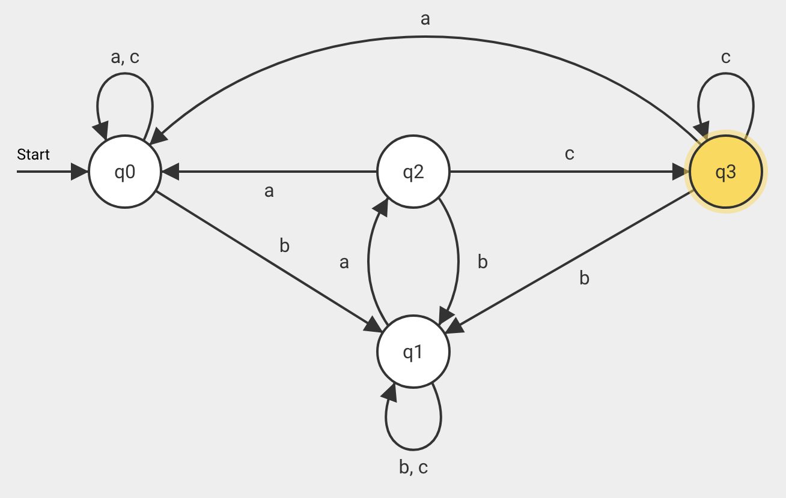

# FSA Exec

FSAexec is a program that runs randomly generated strings through a finite state automation table.


## Authors

- [@Lars Grit](https://gitlab.fdmci.hva.nl/gritla)


## Features

- Randomly generated strings
- Live status prints


## Run Locally

Clone the project

```bash
  https://gitlab.fdmci.hva.nl/aenp/l22-it102/aenp_gritla
```

Go to the project directory

```bash
  cd aenp_gritla/src/week1/
```

Compile code

```bash
  javac FSAexec.java
```

Run code

```bash
  java FSAexec
```


## Tech Stack

**Backend:** Java JDK19


## Flaci - Finite State Automation Model



Pull requests are welcome. For major changes, please open an issue first
to discuss what you would like to change.

Please make sure to update tests as appropriate.

---

# MailChecker

MailChecker is a program that uses RegEx to validate emails on their 'hva.nl' validity.

## Authors

- [@Lars Grit](https://gitlab.fdmci.hva.nl/gritla)


## Features

- Multiple test cases


## Run Locally

Clone the project

```bash
  https://gitlab.fdmci.hva.nl/aenp/l22-it102/aenp_gritla
```

Go to the project directory

```bash
  cd aenp_gritla/src/week1/
```

Compile code

```bash
  javac MailChecker.java
```

Run code

```bash
  java MailChecker
```


## Tech Stack

**Backend:** Java JDK19


Pull requests are welcome. For major changes, please open an issue first
to discuss what you would like to change.

Please make sure to update tests as appropriate.