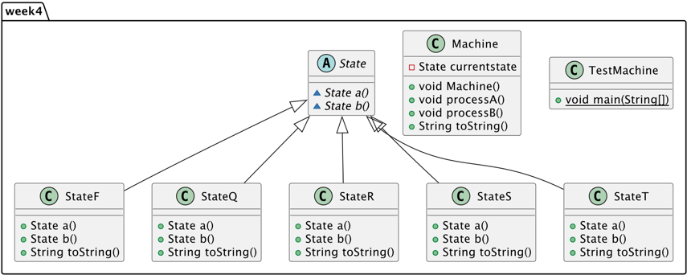

# RSQF Machine 

RSQF Machine is a program that follows a RSQF machine logic and implements it in two ways.

## Authors

- [@Lars Grit](https://gitlab.fdmci.hva.nl/gritla)


## Features

- Test interface


## Run Locally

Clone the project

```bash
  https://gitlab.fdmci.hva.nl/aenp/l22-it102/aenp_gritla
```

Go to the project directory

```bash
  cd aenp_gritla/src/week4
```

Compile code

```bash
  javac TestMachine.java
```

Run code

```bash
  java TestMachine
```


## Tech Stack

**Backend:** Java JDK19

## PlantUML

