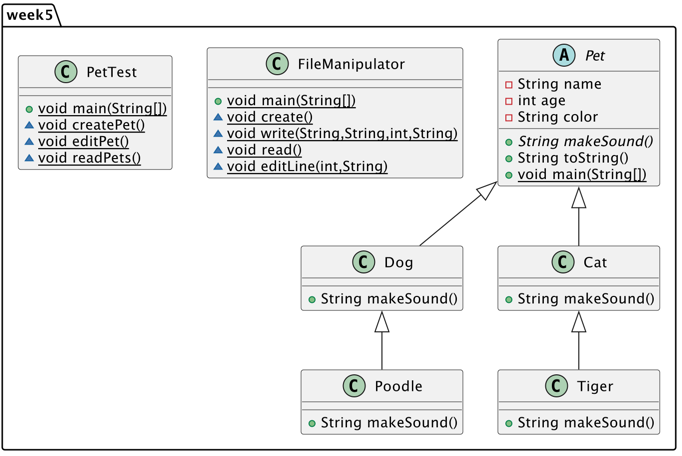

# Pet 2.0

Pet is a program that makes use polymorph and subclasses to make pet sorts with their own values and relevant sound.

In version 2.0 we added singleton design patterns and a Test interface that uses file manipulation to save pets.
## Authors

- [@Lars Grit](https://gitlab.fdmci.hva.nl/gritla)


## Features

- Singleton design patterns
- Text based user interface
- File manipulation 


## Run Locally

Clone the project

```bash
  https://gitlab.fdmci.hva.nl/aenp/l22-it102/aenp_gritla
```

Go to the project directory

```bash
  cd aenp_gritla/src/week5
```

Compile code

```bash
  javac PetTest.java
```

Run code

```bash
  java PetTest
```


## Tech Stack

**Backend:** Java JDK19

## PlantUML

